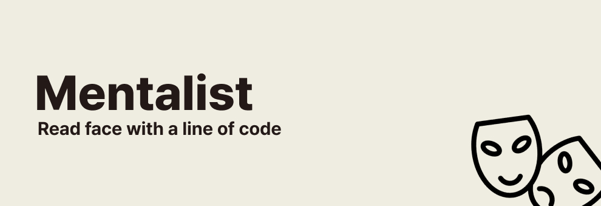

# Mentalist

[](https://swiftpackageindex.com/enebin/Mentalist)
[](https://swiftpackageindex.com/enebin/Mentalist)
[](https://github.com/apple/swift-package-manager)



<div align="center">
<h3> Read face with a line of code </h3>
</div>

```swift
let analysis = try Mentalist.analyze(image: Image("my_face")).first!

print("The emotion on your face is... '\(analysis.dominantEmotion)!'")
// "The emotion on your face is... 'happy'!
```

## Features

**Mentalist** is a Swift-based library designed for analyzing and identifying emotions within a picture.

### 1. Seven Emotion Categories

Mentalist classifies the emotions on faces in a photo into **one of seven categories**. Internally, it utilizes a CoreML model based on FER2013 to analyze emotions displayed in a picture into seven categories: 'happy', 'angry', 'disgust', 'fear', 'sad', 'surprise', and 'neutral'.

### 2. Optimized for Mobile Environment

Mentalist has an optimal size for mobile environments. It also takes approximately **0.06 seconds per analysis** with an **accuracy rate of about 57%**.

### 3. Supports Multi-Face Analysis

Mentalist can detect multiple faces. If multiple faces are detected, it returns a list of multiple analysis results.

## Installation

### Swift Package Manager (SPM)

Follow these steps to install Mentalist using SPM:

1. From within Xcode 13 or later, choose File > Swift Packages > Add Package Dependency.
2. At the next screen, enter the URL for the Mentalist repository(https://github.com/enebin/Mentalist) in the search bar then click Next.
3. For the version rule, select 'Up to Next Minor' and specify the current Mentalist version then click 'Next'.
4. On the final screen, select the Mentalist library and then click 'Finish'.

Mentalist should now be integrated into your project 🚀.

## Usage

```swift
import Mentalist

let analysis = try Mentalist.analyze(image: Image("my_face"))
```

Done!

## Contributing

We welcome contributions to Mentalist! If you'd like to contribute, please fork the repository and use a feature branch. Pull requests are warmly welcome.

## License

Mentalist is released under the MIT License. See [LICENSE](LICENSE) for details.

## Contact

For any questions or suggestions, please feel free to contact me. My email's on my Github profile.
